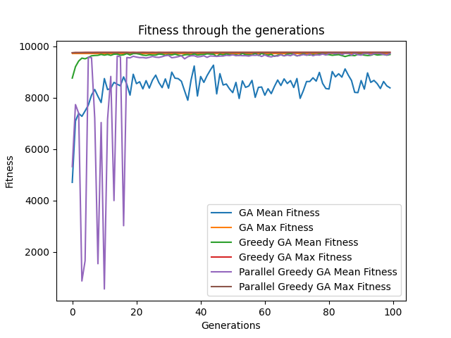
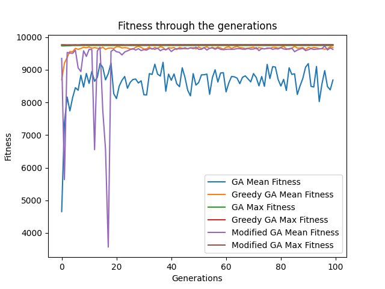
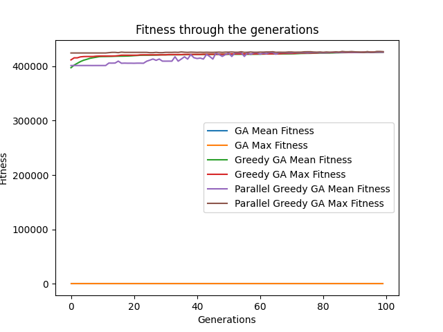
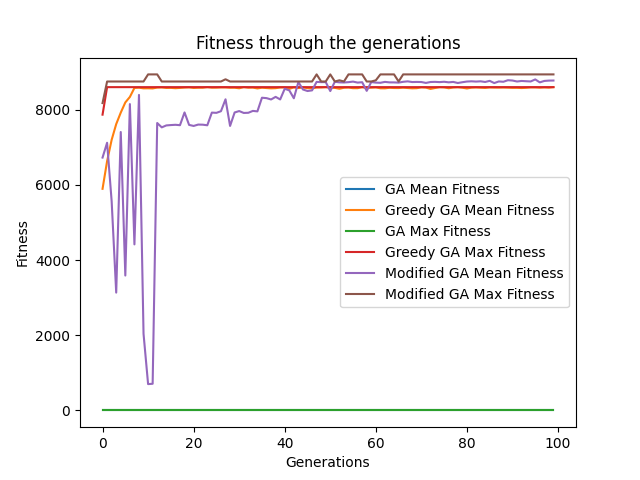
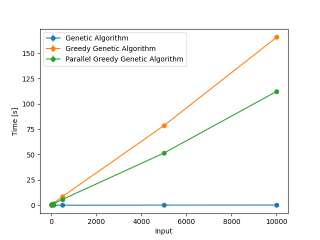
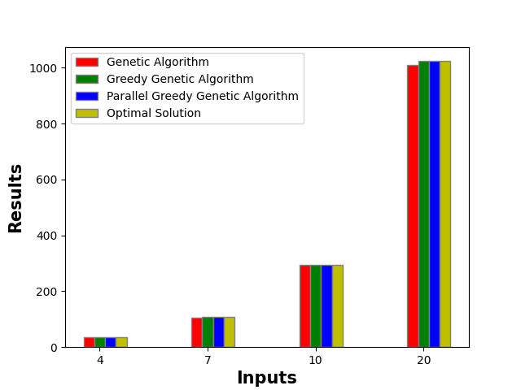
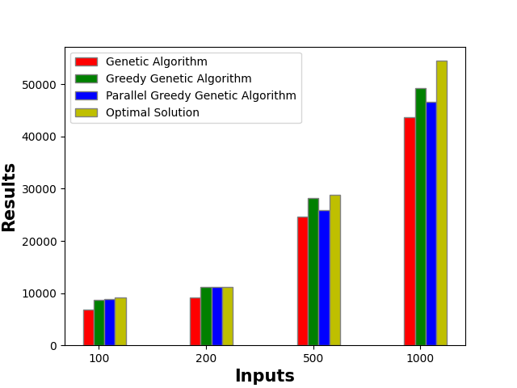
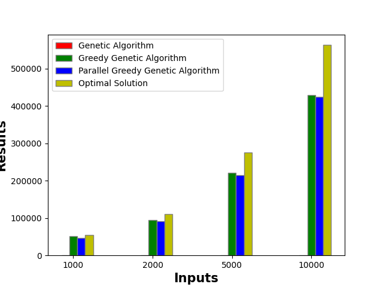

# 0-1-Knapsack-algorithm
Heuristic algorithms to solve 0/1 knapsack problem
1. Genetic Algorithm
2. Greedy Genetic Algorithm
3. Parallel Greedy Genetic Algorithm

## 1. STEPS for SETUP (MacOS)
- Create virtual environment and install the required packages in 'requirement.txt'

`python -m venv venv`\
`source venv/bin/activate`\
`pip install --upgrade pip`\
`pip install -r requirements.txt`\

- To run results follow the steps in *2*.
- Run the one of the following command depending on which algorithm you would like to test.

`python3 genetic_algorithm.py`
`python3 greedy_genetic_algorithm.py`
`python3 modified_genetic_algorithm.py`
- To get the graphs to analyze the performance, run the below command.

`python3 plot_graph.py`

## 2. STEPS to reproduce results
- Create a folder with inputs in the format as in the link below.
[Sample Dataset](http://artemisa.unicauca.edu.co/~johnyortega/instances_01_KP/)

- Add the path to the file in constants.py -> *FILE_PATH'*

You are good to go!

Sample Output:

Population size: (100, 10)
Initial population: 

[[0 1 1 1 0 0 1 0 1 0]
 [1 1 1 1 1 0 1 0 0 0]
 [1 1 0 1 1 0 1 1 0 1]
 [1 1 1 1 0 0 0 0 1 0]
 ..
 [0 1 0 0 1 0 1 1 1 1]]

Final population: 

[[0 1 1 1 0 0 0 1 1 1]
 [0 1 1 1 0 0 0 1 1 1]
 [0 1 1 1 0 0 0 1 1 1]
 [0 1 1 1 0 0 0 1 1 1]
 ..
 [0 1 1 1 0 0 0 1 1 1]]

Fitness of the Final population: 

[295 295 295 295 295 295 295 295 295 295 295 295 295 295 295 295 295 295
 295 295 295 295 295 295 295 295 295 295 295 295 295 295 295 295 295 295
 295 295 295 295 295 295 295 295 295 295 295 295 295 295 295 295 295 295
 295 295 234 295   0 285 295 295 234 295   0   0 285 295 295 285 295 248
 295 210 290 295 295 295 295 295 295 295   0 295 295 295 248 295 295 295
   0 295 295 208 208 290 234   0 295 295]

Maximum value is: 

295 

Items in knapsack: 

[55 10 47  5  4 50  8 61 85 87 55 10 47  5  4 50  8 61 85 87 55 10 47  5
  4 50  8 61 85 87 55 10 47  5  4 50  8 61 85 87 55 10 47  5  4 50  8 61
 85 87 55 10 47  5  4 50  8 61 85 87]

## 3. Results from experimentation

### Fitness Graphs

1. Small inputs ranging from 0-20

2. Inputs ranging from 100-500 

3. Inputs ranging from 1000-10000

### Running Time Comparison

### Optimality check

1. Small Inputs

2. Large Inputs

